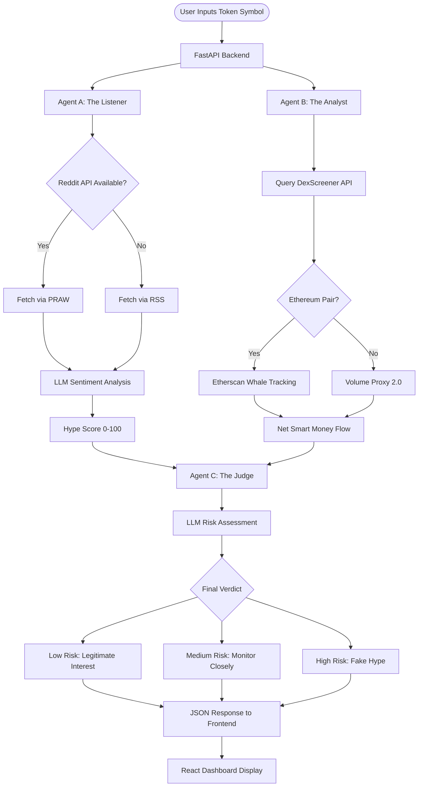

# AlphaDivergence

<p align="left">
  <a href="https://alphadivergence-frontend.onrender.com" target="_blank">
    
  </a>
</p>

<p align="left">
  
  
  
  
  
  
  
  
  
</p>

**Multi-Agent AI System for Detecting "Fake Hype" in Crypto Markets.**

AlphaDivergence is an **intelligent agentic system** that cross-references **Social Sentiment** (Hype) with **On-Chain Data** (Reality) to identify potential rug pulls, hidden gems, and market manipulation.


---

## 🐳 Quick Start with Docker (Recommended)

### Prerequisites
- Docker Desktop 4.0+
- Docker Compose 2.0+

### Installation
1. **Clone the repo:**
   ```bash
   git clone https://github.com/luuisotorres/AlphaDivergence.git
   cd AlphaDivergence
   ```

2. **Setup Environment:**
   ```bash
   cp backend/.env.example .env.docker
   # Add your API keys to .env.docker
   ```

3. **Run with Docker (Development Mode):**
   ```bash
   docker-compose up
   ```
   
   **Access the Application:**
   - **Frontend:** [http://localhost:5173](http://localhost:5173)
   - **Backend API:** [http://localhost:8000](http://localhost:8000)
   - **API Docs:** [http://localhost:8000/docs](http://localhost:8000/docs)
   
   Development mode includes hot-reloading for both frontend and backend.
   
   > **Note:** If you make changes to `Dockerfile` or dependencies, rebuild with:
   > ```bash
   > docker-compose build
   > ```

### Production Deployment
To run in production mode (optimized build, Nginx, no hot-reload):
```bash
docker-compose -f docker-compose.prod.yml up -d
```

**Access the Application:**
- **Frontend:** [http://localhost](http://localhost) (port 80)
- **API (via Nginx proxy):** [http://localhost/api](http://localhost/api)
- **API Docs:** [http://localhost/api/docs](http://localhost/api/docs)

---

## Table of Contents
- [How It Works](#how-it-works)
- [The Agents](#the-agents)
- [Screenshots](#screenshots)
- [Getting Started](#getting-started)
    - [Prerequisites](#prerequisites)
    - [Installation](#installation)
    - [Configuration](#configuration)
- [API Documentation](#api-documentation)
- [Documentation](#documentation)

---

## How It Works



---

## The Agents

The system is powered by three specialized AI Agents:

### Agent A: The Listener (Social Sentiment)
- **Role:** Scrapes Reddit (r/CryptoMoonShots, r/Solana, r/memecoin, etc.) to detect trending tokens.
- **Tech:** Reddit API (PRAW) + RSS Fallback + Gemini/OpenAI (Sentiment Analysis).
- **Output:** `Hype Score` (0-100), `Trending Volume`.

### Agent B: The Analyst (On-Chain Truth)
- **Role:** Queries real-time market data to verify if the money matches the mouth.
- **Tech:** DexScreener API + Etherscan API.
- **Features:**
    - **Deep Whale Tracking (ETH):** Tracks specific wallet transfers > $50k.
    - **Volume Proxy 2.0 (SOL/BSC/Base):** Estimates net flow based on transaction volume and buy/sell ratios.
- **Output:** `Net Smart Money Flow`, `Liquidity Health`.

### Agent C: The Judge (Final Verdict)
- **Role:** The Orchestrator. It takes data from A and B and uses a Large Language Model (LLM) to write a professional risk assessment.
- **Tech:** OpenAI (GPT-4o) or Google Gemini (Flash 2.0).
- **Output:** `Risk Level`, `Verdict`, `Reasoning`.

---

## Screenshots


 
---
 
---
 
---

---

---


---

## Getting Started

### Prerequisites
- Python 3.10+
- Node.js 18+
- `uv` (Python package manager)

### Installation

1.  **Clone the repo:**
    ```bash
    git clone https://github.com/luuisotorres/AlphaDivergence.git
    cd AlphaDivergence
    ```

2.  **Backend Setup:**
    ```bash
    cd backend
    # Create .env file
    cp .env.example .env
    # Install dependencies
    uv sync
    # Run server
    uv run uvicorn src.main:app --reload
    ```

3.  **Frontend Setup:**
    ```bash
    cd frontend
    npm install
    npm run dev
    ```

4.  **Configuration (.env):**
    To unlock the full power, add your keys to `backend/.env`:
    - `OPENAI_API_KEY` or `GEMINI_API_KEY` (Required for AI Verdicts)
    - `ETHERSCAN_API_KEY` (Optional, for Whale Tracking)
    - `REDDIT_CLIENT_ID` (Optional, for faster scraping)

5.  **Access the Application:**
    - **Frontend Dashboard:** [http://localhost:5173](http://localhost:5173)
    - **Backend API:** [http://127.0.0.1:8000](http://127.0.0.1:8000)
    - **API Docs (Swagger):** [http://127.0.0.1:8000/docs](http://127.0.0.1:8000/docs)

---

## API Documentation

The backend exposes a REST API for integration.

**Base URL:** `http://127.0.0.1:8000`

**Interactive Documentation:**
- **Swagger UI:** [http://127.0.0.1:8000/docs](http://127.0.0.1:8000/docs)
- **ReDoc:** [http://127.0.0.1:8000/redoc](http://127.0.0.1:8000/redoc)

FastAPI automatically generates interactive API documentation where you can test endpoints directly in your browser.

---

### `GET /analyze/{token}`

Analyzes a specific token symbol.

**Example Request:**
```bash
curl -X 'GET' \
  'http://127.0.0.1:8000/analyze/LINK' \
  -H 'accept: application/json'
```

**Example Response:**
```json
{
  "token": "LINK",
  "hype_analysis": {
    "token": "LINK",
    "hype_score": 63,
    "trending_volume": "Medium",
    "details": {
      "reddit_data": {
        "posts": 10,
        "upvotes": 100,
        "sentiment_score": 0.63,
        "top_posts": [
          {
            "title": "Bitget’s Stock Futures Volume exceeds $1 billion",
            "url": "https://www.reddit.com/r/CryptoCurrency/comments/1p0v23y/bitgets_stock_futures_volume_exceeds_1_billion/",
            "score": 10,
            "sentiment": "Positive"
          },
          {
            "title": "Daily Crypto Discussion - November 19, 2025 (GMT+0)",
            "url": "https://www.reddit.com/r/CryptoCurrency/comments/1p0tnsu/daily_crypto_discussion_november_19_2025_gmt0/",
            "score": 10,
            "sentiment": "Neutral"
          },
          {
            "title": "Daily General Discussion - November 19, 2025 (UTC+0)",
            "url": "https://www.reddit.com/r/ethtrader/comments/1p0tnra/daily_general_discussion_november_19_2025_utc0/",
            "score": 10,
            "sentiment": "Neutral"
          },
          {
            "title": "Moustifuck $BZZ - The memecoin fighting malaria and other diseases with blockchain transparency",
            "url": "https://www.reddit.com/r/CryptoMoonShots/comments/1p0r5av/moustifuck_bzz_the_memecoin_fighting_malaria_and/",
            "score": 10,
            "sentiment": "Positive"
          },
          {
            "title": "DOGESTATION, legit free doge mining, high profits no deposit needed to get started, use referral for a jumpstart, 2x free box's, VIP rewards.",
            "url": "https://www.reddit.com/r/CryptoMoonShots/comments/1p0poj8/dogestation_legit_free_doge_mining_high_profits/",
            "score": 10,
            "sentiment": "Positive"
          },
          {
            "title": "The Epic Evolution of Pepe: From OG Roots to Synergistic Powerhouse",
            "url": "https://www.reddit.com/r/altcoin/comments/1p0megi/the_epic_evolution_of_pepe_from_og_roots_to/",
            "score": 10,
            "sentiment": "Positive"
          },
          {
            "title": "Seeker build quality and lack of support",
            "url": "https://www.reddit.com/r/solana/comments/1p0ivle/seeker_build_quality_and_lack_of_support/",
            "score": 10,
            "sentiment": "Negative"
          },
          {
            "title": "This is your chance to become extremely wealthy.",
            "url": "https://www.reddit.com/r/ethtrader/comments/1p0d8bz/this_is_your_chance_to_become_extremely_wealthy/",
            "score": 10,
            "sentiment": "Positive"
          },
          {
            "title": "Mastercard Selects Polygon to Power Verified Username Transfers for Self-Custody Wallets",
            "url": "https://www.reddit.com/r/CryptoCurrency/comments/1p0bbox/mastercard_selects_polygon_to_power_verified/",
            "score": 10,
            "sentiment": "Positive"
          },
          {
            "title": "State of Crypto Survey Stakeholder report",
            "url": "https://www.reddit.com/r/CryptoCurrency/comments/1p07f08/state_of_crypto_survey_stakeholder_report/",
            "score": 10,
            "sentiment": "Neutral"
          }
        ]
      }
    }
  },
  "onchain_analysis": {
    "token": "LINK",
    "net_smart_money_flow": "Sell Pressure",
    "whale_concentration": 0,
    "details": {
      "price": 13.57,
      "liquidity": 28081667.51,
      "volume_24h": 7099737.8,
      "fdv": 13573337291,
      "pair_url": "https://dexscreener.com/ethereum/0xa6cc3c2531fdaa6ae1a3ca84c2855806728693e8",
      "whale_data": {
        "whale_buys_usd": 0,
        "whale_sells_usd": 0,
        "whale_tx_count": 0
      },
      "chain_id": "ethereum",
      "tracking_type": "Deep Whale Analysis",
      "net_flow_usd": -2052778
    }
  },
  "final_verdict": {
    "risk_level": "High",
    "verdict": "Fake Hype",
    "reasoning": "The social hype around LINK is medium with a positive sentiment, but on-chain data shows sell pressure with no whale buying activity and a negative net flow. This indicates a disconnect between social sentiment and market reality.",
    "input_summary": {
      "hype_score": 63,
      "smart_money_flow": "Sell Pressure"
    }
  }
}
```

---

## Documentation

For more details on the agent architecture, see [agents.md](agents.md).


## Author
[Luis Fernando Torres](https://github.com/luuisotorres)

[](https://www.linkedin.com/in/luuisotorres/)
[](https://medium.com/@luuisotorres)
[](https://www.kaggle.com/lusfernandotorres)
[](https://huggingface.co/luisotorres)

## License

This project is licensed under the MIT License. See the [LICENSE](LICENSE) file for details.